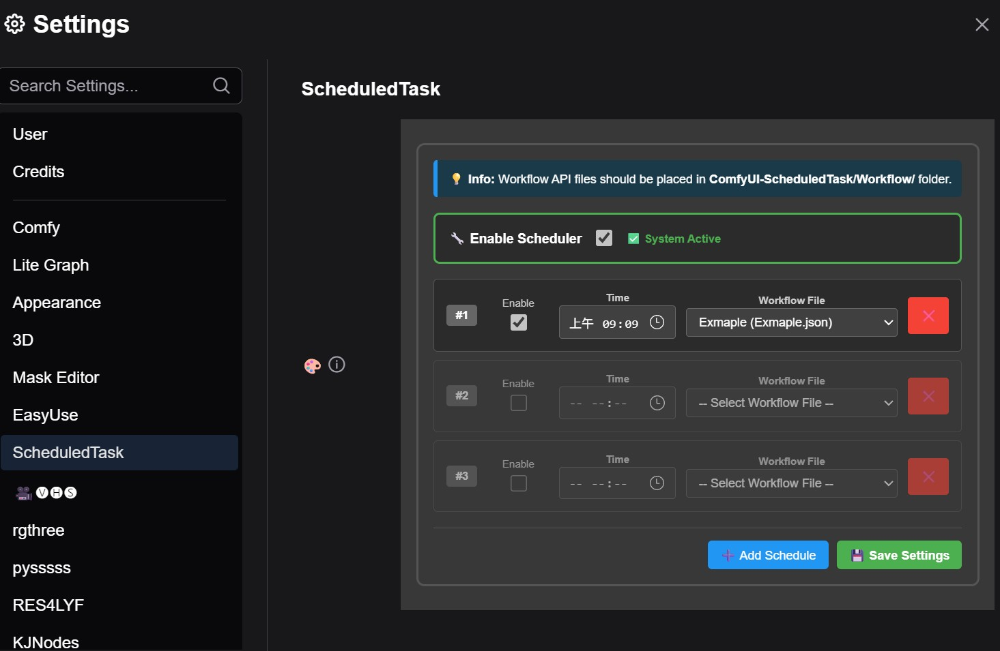
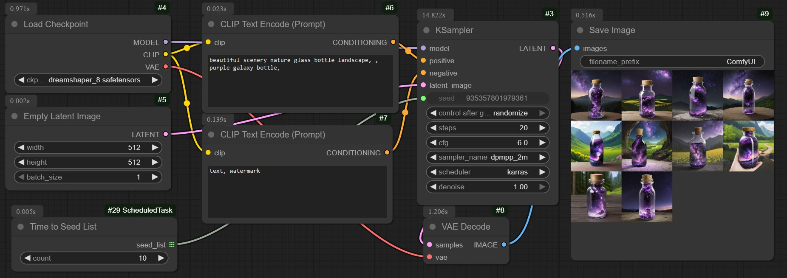
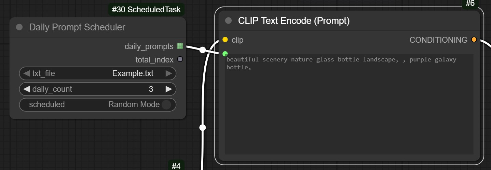

# ComfyUI-ScheduledTask
# ComfyUI 定時任務擴展



A powerful workflow scheduling extension for ComfyUI that enables automated daily execution of workflows with an intuitive web interface.

一個強大的 ComfyUI 工作流程排程擴展，支援自動化每日執行工作流程，並提供直觀的網頁介面。

## ✨ Features 功能特色

- **🕒 Daily Workflow Scheduling 每日工作流程排程** - Set up multiple workflows to run automatically at specific times 設置多個工作流程在指定時間自動執行
- **🎛️ Web Interface 網頁介面** - Easy-to-use settings panel integrated into ComfyUI's settings page 易於使用的設置面板，整合到 ComfyUI 設置頁面
- **📝 Right-Click Workflow Saving 右鍵保存工作流程** - Save current workflow as schedulable task with one click 一鍵將當前工作流程保存為可排程任務
- **🔧 Global Enable/Disable 全域啟用/停用** - Master switch to enable or disable all schedules 主開關來啟用或停用所有排程
- **⚡ Individual Task Control 個別任務控制** - Enable/disable individual schedules independently 獨立啟用/停用個別排程
- **🎲 TimeToSeedList Node 時間隨機種子節點** - Generate time-based random seeds for varied outputs 產生基於時間的隨機種子以獲得多樣化輸出
- **📊 Real-time Status 即時狀態** - Monitor schedule status and execution logs 監控排程狀態和執行日誌
- **🔄 Auto-refresh 自動刷新** - Automatically detects and loads new workflow files 自動檢測並載入新的工作流程檔案

## 🚀 Installation 安裝方式

### Method 1: ComfyUI Manager (Recommended)
### 方法 1：ComfyUI 管理器（推薦）
1. Open ComfyUI Manager 開啟 ComfyUI 管理器
2. Search for "ComfyUI-ScheduledTask" 搜尋 "ComfyUI-ScheduledTask"
3. Click Install 點擊安裝
4. Restart ComfyUI 重啟 ComfyUI

### Method 2: Manual Installation
### 方法 2：手動安裝
1. Navigate to your ComfyUI custom_nodes directory: 導航到您的 ComfyUI custom_nodes 目錄：
   ```bash
   cd ComfyUI/custom_nodes/
   ```

2. Clone this repository: 克隆此儲存庫：
   ```bash
   git clone https://github.com/yourusername/ComfyUI-ScheduledTask.git
   ```

3. Install dependencies: 安裝依賴項：
   ```bash
   cd ComfyUI-ScheduledTask
   pip install -r requirements.txt
   ```

4. Restart ComfyUI 重啟 ComfyUI

## 📋 Requirements 系統需求

- Python 3.8+
- ComfyUI
- Required Python packages (auto-installed): 所需 Python 套件（自動安裝）：
  - `schedule`
  - `requests`

## 🎯 Quick Start 快速開始

### 1. Save a Workflow as Task 將工作流程保存為任務
1. Design your workflow in ComfyUI 在 ComfyUI 中設計您的工作流程
2. Right-click on empty canvas area 右鍵點擊空白畫布區域
3. Select "📋 Save as Task" 選擇 "📋 Save as Task"
4. Enter a name for your workflow 為您的工作流程輸入名稱
5. Click Save 點擊保存

### 2. Schedule Your Workflow 排程您的工作流程
1. Go to ComfyUI Settings 前往 ComfyUI 設置
2. Find "scheduledTask" section 找到 "scheduledTask" 部分
3. Enable "🔧 Enable Scheduler" 啟用 "🔧 Enable Scheduler"
4. Configure your schedules: 配置您的排程：
   - Set execution time (24-hour format) 設置執行時間（24小時制）
   - Select workflow file 選擇工作流程檔案
   - Enable the schedule 啟用排程
5. Click "💾 Save Settings" 點擊 "💾 Save Settings"

### 3. Monitor Execution 監控執行
- Check ComfyUI console for execution logs 檢查 ComfyUI 控制台的執行日誌
- View schedule status in settings panel 在設置面板查看排程狀態
- Modify schedules anytime 隨時修改排程

## 🔧 Usage Guide 使用指南

### Web Interface 網頁介面

The extension adds a "Task" section to ComfyUI's settings page with the following controls:

擴展在 ComfyUI 設置頁面中新增了一個 "Task" 部分，包含以下控制項：

- **Global Enable Switch 全域啟用開關**: Master control for all schedules 所有排程的主控制
- **Schedule Rows 排程行**: Individual schedule configurations 個別排程配置
  - **Enable 啟用**: Toggle individual schedule on/off 切換個別排程開/關
  - **Time 時間**: Set execution time (HH:MM format) 設置執行時間（HH:MM 格式）
  - **Workflow File 工作流程檔案**: Select from available workflow files 從可用的工作流程檔案中選擇
  - **Delete 刪除**: Remove schedule row 移除排程行

### TimeToSeedList Node 時間隨機種子列表節點



A special utility node that generates time-based random seeds:

一個特殊的實用節點，產生基於時間的隨機種子：

**Inputs 輸入:**
- `count` (INT): Number of random seeds to generate (1-10000) 要產生的隨機種子數量（1-10000）

**Outputs 輸出:**
- `seed_list` (INT List): List of random integers based on current time 基於當前時間的隨機整數列表

**Usage 用法:**
- Perfect for creating varied outputs in scheduled workflows 非常適合在排程工作流程中創建多樣化輸出
- Seeds change automatically based on execution time 種子根據執行時間自動變化
- Ensures different results for each scheduled run 確保每次排程運行都有不同結果
- Setting this for create large image list and run  在設定時間內進行大規模隨機排程

### Daily Prompt Scheduler Node / 每日提示詞排程節點



A ComfyUI node that provides time-based prompt management with daily rotation capabilities.
提供基於時間的提示詞管理和每日輪換功能。

####Features / 功能特色

- **Daily Rotation / 每日輪換**: Automatically selects different prompts each day / 每天自動選擇不同的提示詞
- **Two Operation Modes / 兩種運作模式**:
  - **Scheduled Mode / 排程模式**: Sequential selection with time seed (predictable daily progression) / 使用時間種子的順序選擇（可預測的每日進展）
  - **Random Mode / 隨機模式**: Random selection with daily seed (random but consistent per day) / 使用每日種子的隨機選擇（隨機但每天一致）
- **File-based Management / 檔案管理**: Load prompts from text files in the `Prompt` folder / 從Prompt資料夾中的文字檔載入提示詞
- **Individual Time Seeds / 獨立時間種子**: Each text file maintains its own scheduling timeline / 每個文字檔維護自己的排程時間線
- **List Output / 列表輸出**: Returns prompts as a connectable string list for workflow integration / 返回可連接的字串列表用於工作流程整合
- **Loop Integration / 迴圈整合**: Provides count output for easy loop control / 提供計數輸出便於迴圈控制

#### Setup / 設置

1. Visit`Prompt` folder in your node directory: `/ComfyUI-ScheduledTask/Prompt/` / 在節點目錄中訪問`Prompt`資料夾：`/ComfyUI-ScheduledTask/Prompt/`
2. Place your text files (`.txt`) in this folder / 將文字檔（`.txt`）放置在此資料夾中
3. Each line in the text file represents one prompt (empty lines are ignored) / 文字檔中每一行代表一個提示詞（空行會被忽略）

#### Inputs / 輸入參數

- **txt_file / 文字檔**: Dropdown selection of available text files in the Prompt folder / 下拉選單選擇Prompt資料夾中的可用文字檔
- **daily_count / 每日數量**: Number of prompts to select each day (1-5000) / 每天選擇的提示詞數量（1-5000）
- **scheduled / 排程**: Toggle between Scheduled and Random modes (Default is Random Mode)/ 在排程模式和隨機模式之間切換，預設為隨機模式，每天隨機抽選提示組數

#### Outputs / 輸出參數

- **daily_prompts / 每日提示詞**: List of selected prompts (STRING list, connectable to other nodes) / 選中的提示詞列表（字串列表，可連接到其他節點）
- **total_index / 總數索引**: Number of prompts actually returned (INT, useful for loop control) / 實際返回的提示詞數量（整數，用於迴圈控制）

#### Operation Modes / 運作模式

#### Scheduled Mode / 排程模式
- **First Run / 首次運行**: Creates a time seed based on current date / 基於當前日期創建時間種子
- **Daily Progression / 每日進展**: Selects prompts sequentially / 按順序選擇提示詞
- **Example / 範例**: With 12 prompts, selecting 3 per day / 有12個提示詞，每天選擇3個：
  - Day 1 / 第1天: Prompts 1, 2, 3 / 提示詞1, 2, 3
  - Day 2 / 第2天: Prompts 4, 5, 6 / 提示詞4, 5, 6
  - Day 3 / 第3天: Prompts 7, 8, 9 / 提示詞7, 8, 9
  - Day 4 / 第4天: Prompts 10, 11, 12 / 提示詞10, 11, 12
  - Day 5 / 第5天: Prompts 1, 2, 3 (cycles back) / 提示詞1, 2, 3（循環回到開頭）

#### Random Mode / 隨機模式
- **Daily Random / 每日隨機**: Uses date-based seed for random selection / 使用基於日期的種子進行隨機選擇
- **Consistent / 一致性**: Same random selection throughout the day / 整天保持相同的隨機選擇
- **Example / 範例**: Random but fixed selection per day (e.g., prompts 3, 7, 11) / 每天隨機但固定的選擇（例如：提示詞3, 7, 11）

#### File Management / 檔案管理

- **Multiple Files / 多檔案**: Each `.txt` file has independent scheduling / 每個`.txt`檔案都有獨立的排程
- **Time Seeds / 時間種子**: Stored as `{filename}_time_seed.json` in the Prompt folder(If Scheduled) / 以`{檔名}_time_seed.json`的形式儲存在Prompt資料夾中，假使是使用排程模式
- **Auto-wrapping / 自動循環**: Never causes index errors, automatically wraps around (With Time Seed) / 永不會造成索引錯誤，自動循環，但可能會因此採樣到相同的圖片，請配合時間種子使用
- **UTF-8 Support / UTF-8支援**: Handles international characters and languages / 支援國際字符和多種語言

### File Structure 檔案結構

```
ComfyUI-ScheduledTask/
├── __init__.py              # Extension entry point 擴展入口點
├── scheduler.py             # Core scheduling logic & TimeToSeedList node 核心排程邏輯和時間種子節點
├── web_handler.py           # API endpoints API 端點
├── Prompt/                  # 提示詞檔案庫
│   ├── Example.txt          # 範例檔案
├── web/
│   └── scheduled_task.js    # Frontend interface 前端介面
├── Workflow/                # Saved workflow files (auto-created) 保存的工作流程檔案（自動創建）
│   ├── workflow1.json
│   └── workflow2.json
└── schedules.json           # Schedule configuration (auto-created) 排程配置（自動創建）

```
### Workflow Format 工作流程格式
Saved workflows are stored in ComfyUI API format:

保存的工作流程以 ComfyUI API 格式存儲：
```json
{
  "1": {
    "class_type": "CheckpointLoaderSimple",
    "inputs": {
      "ckpt_name": "model.safetensors"
    }
  },
  "2": {
    "class_type": "KSampler",
    "inputs": {
      "seed": ["3", 0],
      "steps": 20,
      "cfg": 8.0
    }
  }
}
```

### Schedule Configuration 排程配置
```json
{
  "schedules": [
    {
      "time": "09:00",
      "workflow": "morning_render.json",
      "enabled": true
    }
  ],
  "globalEnabled": true,
  "updated_at": "2024-01-01T09:00:00"
}
```

## 🛠️ Advanced Configuration 進階配置

### Custom ComfyUI URL 自定義 ComfyUI URL
If ComfyUI runs on a different port, modify `scheduler.py`:

如果 ComfyUI 在不同端口運行，修改 `scheduler.py`：
```python
self.comfyui_url = "http://127.0.0.1:YOUR_PORT"
```

### Schedule Frequency 排程頻率
Currently supports daily schedules. For custom frequencies, modify the `create_job` method in `scheduler.py`.

目前支持每日排程。對於自定義頻率，請修改 `scheduler.py` 中的 `create_job` 方法。

## 🐛 Troubleshooting 故障排除

### Common Issues 常見問題

**Schedules not executing: 排程未執行：**
- Check if global scheduler is enabled 檢查全域排程器是否已啟用
- Verify individual schedule is enabled 驗證個別排程是否已啟用
- Check ComfyUI console for error messages 檢查 ComfyUI 控制台的錯誤消息
- Ensure workflow files exist in `Workflow/` folder 確保工作流程檔案存在於 `Workflow/` 資料夾中

**Workflow not saving: 工作流程無法保存：**
- Ensure workflow has nodes before saving 保存前確保工作流程有節點
- Check for invalid characters in filename 檢查檔名中的無效字符

**Web interface not appearing: 網頁介面未出現：**
- Restart ComfyUI completely 完全重啟 ComfyUI
- Check browser console for JavaScript errors 使用F12檢查瀏覽器控制台的 JavaScript 錯誤
- Verify extension is properly installed 驗證節點是否正確安裝

### Debug Logging 除錯日誌
Enable debug logging by modifying `scheduler.py`:

透過修改 `scheduler.py` 啟用除錯日誌：
```python
logging.basicConfig(level=logging.DEBUG)
```

## 🤝 Contributing 貢獻

Contributions are welcome! Please feel free to submit issues, feature requests, or pull requests.

歡迎貢獻！請隨時提交問題、功能請求或拉取請求。